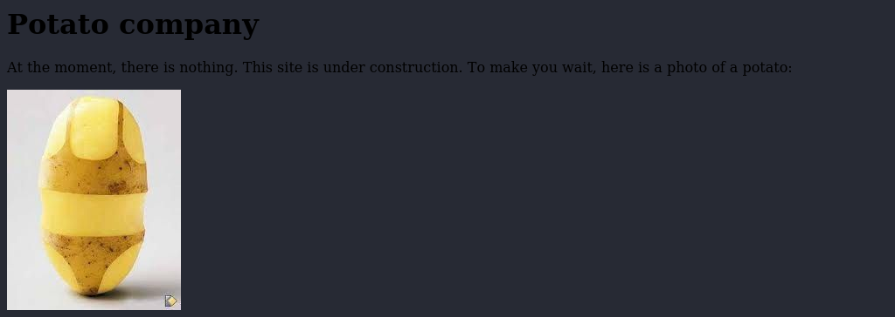

# Welcome to my terminal window!                                                               
###  This system is for the use of authorized users only.  Usage of   
###  this system may be monitored and recorded by system personnel.                                                                   
###           Other than that, feel free to look around!  
### root@codex # ls
### [boxes](./boxes.md) [code](./code.md) [red_teaming](./red_teaming.md) [CTF](./ctf.md) [about](./about.md)
### root@codex # cd ./boxes
### root@codex # ls
### [../](../)
### [Potato](boxes/potato.md)
### root@codex # vi potato.md

# Potato

Started doing this box late at night with Jonathan and X3ron because I clearly have no life.  
 
## Recon
### Initial nmap  
```
# Nmap 7.91 scan initiated Mon May 10 10:04:03 2021 as: nmap -vv --reason -Pn -A --osscan-guess --version-all -p- -oN /root/Desktop/Labs/ProvingGrounds/Potato/results/192.168.124.101/scans/_full_tcp_nmap.txt -oX /root/Desktop/Labs/ProvingGrounds/Potato/results/192.168.124.101/scans/xml/_full_tcp_nmap.xml 192.168.124.101
Increasing send delay for 192.168.124.101 from 0 to 5 due to 706 out of 2351 dropped probes since last increase.
Nmap scan report for 192.168.124.101
Host is up, received user-set (0.22s latency).
Scanned at 2021-05-10 10:04:04 EDT for 1419s
Not shown: 65532 closed ports
Reason: 65532 resets
PORT     STATE SERVICE REASON         VERSION
22/tcp   open  ssh     syn-ack ttl 63 OpenSSH 8.2p1 Ubuntu 4ubuntu0.1 (Ubuntu Linux; protocol 2.0)
| ssh-hostkey: 
|   3072 ef:24:0e:ab:d2:b3:16:b4:4b:2e:27:c0:5f:48:79:8b (RSA)
| ssh-rsa AAAAB3NzaC1yc2EAAAADAQABAAABgQDamdAqH2ZyWoYj0tstPK0vbVKI+9OCgtkGDoynffxqV2kE4ceZn77FBuMGFKLU50Uv5RMUTFTX4hm1ijh77KMGG1CmAk2YWvEDhxbCBPCohp+xXMBXHBYoMbEVl/loKL2UW6USnKorOgwxUdoMAwDxIrohGHQ5WNUADRaqt1eHuHxuJ8Bgi8yzqP/26ePQTLCfwAZMq+SYPJedZBmfJJ3Brhb/CGgzgRU8BpJGI8IfBL5791JTn2niEgoMAZ1vdfnSx0m49uk8npd0h5hPQ+ucyMh+Q35lJ1zDq94E24mkgawDhEgmLtb23JDNdY4rv/7mAAHYA5AsRSDDFgmbXEVcC7N1c3cyrwVH/w+zF5SKOqQ8hOF7LRCqv0YQZ05wyiBu2OzbeAvhhiKJteICMuitQAuF6zU/dwjX7oEAxbZ2GsQ66kU3/JnL4clTDATbT01REKJzH9nHpO5sZdebfLJdVfx38qDrlS+risx1QngpnRvWTmJ7XBXt8UrfXGenR3U=
|   256 f2:d8:35:3f:49:59:85:85:07:e6:a2:0e:65:7a:8c:4b (ECDSA)
| ecdsa-sha2-nistp256 AAAAE2VjZHNhLXNoYTItbmlzdHAyNTYAAAAIbmlzdHAyNTYAAABBBNoh1z4mRbfROqXjtv9CG7ZYGiwN29OQQCVXMLce4ejLzy+0Bvo7tYSb5PKVqgO5jd1JaB3LLGWreXo6ZY3Z8T8=
|   256 0b:23:89:c3:c0:26:d5:64:5e:93:b7:ba:f5:14:7f:3e (ED25519)
|_ssh-ed25519 AAAAC3NzaC1lZDI1NTE5AAAAIDXv++bn0YEgaoSEmMm3RzCzm6pyUJJSsSW9FMBqvZQ3
80/tcp   open  http    syn-ack ttl 63 Apache httpd 2.4.41 ((Ubuntu))
| http-methods: 
|_  Supported Methods: GET HEAD POST OPTIONS
|_http-server-header: Apache/2.4.41 (Ubuntu)
|_http-title: Potato company
2112/tcp open  ftp     syn-ack ttl 63 ProFTPD
| ftp-anon: Anonymous FTP login allowed (FTP code 230)
| -rw-r--r--   1 ftp      ftp           901 Aug  2  2020 index.php.bak
|_-rw-r--r--   1 ftp      ftp            54 Aug  2  2020 welcome.msg
OS fingerprint not ideal because: maxTimingRatio (1.546000e+00) is greater than 1.4
Aggressive OS guesses: Linux 2.6.32 (91%), Linux 2.6.32 or 3.10 (91%), Linux 4.4 (91%), WatchGuard Fireware 11.8 (91%), Synology DiskStation Manager 5.1 (90%), Linux 2.6.35 (90%), Linux 2.6.39 (90%), Linux 3.10 - 3.12 (90%), Linux 3.5 (90%), Linux 4.2 (90%)
No exact OS matches for host (test conditions non-ideal).
TCP/IP fingerprint:
SCAN(V=7.91%E=4%D=5/10%OT=22%CT=1%CU=37236%PV=Y%DS=2%DC=T%G=N%TM=609942DF%P=x86_64-pc-linux-gnu)
SEQ(SP=FE%GCD=1%ISR=106%TI=Z%TS=A)
OPS(O1=M506ST11NW7%O2=M506ST11NW7%O3=M506NNT11NW7%O4=M506ST11NW7%O5=M506ST11NW7%O6=M506ST11)
WIN(W1=FE88%W2=FE88%W3=FE88%W4=FE88%W5=FE88%W6=FE88)
ECN(R=Y%DF=Y%T=40%W=FAF0%O=M506NNSNW7%CC=Y%Q=)
T1(R=Y%DF=Y%T=40%S=O%A=S+%F=AS%RD=0%Q=)
T2(R=N)
T3(R=N)
T4(R=N)
T5(R=Y%DF=Y%T=40%W=0%S=Z%A=S+%F=AR%O=%RD=0%Q=)
T6(R=N)
T7(R=N)
U1(R=Y%DF=N%T=40%IPL=164%UN=0%RIPL=G%RID=G%RIPCK=G%RUCK=G%RUD=G)
IE(R=Y%DFI=N%T=40%CD=S)

Uptime guess: 19.711 days (since Tue Apr 20 17:23:57 2021)
Network Distance: 2 hops
TCP Sequence Prediction: Difficulty=255 (Good luck!)
IP ID Sequence Generation: All zeros
Service Info: OS: Linux; CPE: cpe:/o:linux:linux_kernel

TRACEROUTE (using port 53/tcp)
HOP RTT       ADDRESS
1   242.15 ms 192.168.49.1
2   242.68 ms 192.168.124.101

Read data files from: /usr/bin/../share/nmap
OS and Service detection performed. Please report any incorrect results at https://nmap.org/submit/ .
# Nmap done at Mon May 10 10:27:43 2021 -- 1 IP address (1 host up) scanned in 1420.56 seconds
```

Ok, so SSH, Web server on 80, and FTP on a weird port. Seems like a standard box. Lets see what the webpage is like.

   

Lets gobust the web page.   

### Gobuster
```
/.htaccess (Status: 403) [Size: 280]
/.htaccess.php (Status: 403) [Size: 280]
/.htaccess.asp (Status: 403) [Size: 280]
/.htaccess.aspx (Status: 403) [Size: 280]
/.htaccess.jsp (Status: 403) [Size: 280]
/.htaccess.txt (Status: 403) [Size: 280]
/.htaccess.html (Status: 403) [Size: 280]
/.hta (Status: 403) [Size: 280]
/.hta.asp (Status: 403) [Size: 280]
/.hta.aspx (Status: 403) [Size: 280]
/.hta.jsp (Status: 403) [Size: 280]
/.hta.txt (Status: 403) [Size: 280]
/.hta.html (Status: 403) [Size: 280]
/.hta.php (Status: 403) [Size: 280]
/.htpasswd (Status: 403) [Size: 280]
/.htpasswd.aspx (Status: 403) [Size: 280]
/.htpasswd.jsp (Status: 403) [Size: 280]
/.htpasswd.txt (Status: 403) [Size: 280]
/.htpasswd.html (Status: 403) [Size: 280]
/.htpasswd.php (Status: 403) [Size: 280]
/.htpasswd.asp (Status: 403) [Size: 280]
/admin (Status: 301) [Size: 318]
/index.php (Status: 200) [Size: 245]
/index.php (Status: 200) [Size: 245]
/server-status (Status: 403) [Size: 280]
```

Ok so it seems like there is an admin page. Lets have a look.  

     

Lets gobust the /admin directory and see if we find anything.  

Oh nice, /logs seems interesting.  
As you can see, it shows the username is admin.  Lets try brute forcing.  
I initially tried to use THC Hydra, but I couldnt be bothered to mess with the failure response option so I decided to go with burp intruder.  


Unfortunately, the brute force didn't work :(

Lets go back to the scan results.

```
2112/tcp open  ftp     syn-ack ttl 63 ProFTPD
| ftp-anon: Anonymous FTP login allowed (FTP code 230)
| -rw-r--r--   1 ftp      ftp           901 Aug  2  2020 index.php.bak
|_-rw-r--r--   1 ftp      ftp            54 Aug  2  2020 welcome.msg
```

Oh yeah we have FTP with some stuff inside. Lets have a look.

index.php.bak looks like a backup of the login page php code. Lets have a look.  

```
<html>
<head></head>
<body>

<?php

$pass= "potato"; //note Change this password regularly

if($_GET['login']==="1"){
  if (strcmp($_POST['username'], "admin") == 0  && strcmp($_POST['password'], $pass) == 0) {
    echo "Welcome! </br> Go to the <a href=\"dashboard.php\">dashboard</a>";
    setcookie('pass', $pass, time() + 365*24*3600);
  }else{
    echo "<p>Bad login/password! </br> Return to the <a href=\"index.php\">login page</a> <p>";
  }
  exit();
}
?>


  <form action="index.php?login=1" method="POST">
                <h1>Login</h1>
                <label><b>User:</b></label>
                <input type="text" name="username" required>
                </br>
                <label><b>Password:</b></label>
                <input type="password" name="password" required>
                </br>
                <input type="submit" id='submit' value='Login' >
  </form>
</body>
</html>
```

This looks like it could be the [php strcmp vulnerability](https://www.doyler.net/security-not-included/bypassing-php-strcmp-abctf2016). Lets give it a shot.  
This vuln seems to work becuase if you compare an array with a string in php, it returns null. And since == was used instead of ===, type checking isnt in place. So
null == 0 returns true. Now, back into burp, lets intercept the request and pass an array as the password variable.  
  
Oh nice it lets us into the admin page!  Lets have a look around.

The ping page doesnt seem to accept user input, ive tried passing them as variables in the url with no success. So the standard ping command injection wont work here.

However, in the logs section, it seems to pass a file name as a POST param. Lets see if we can LFI...

It works! And there seems to be a hash stored in /etc/passwd... Lets crack it!  
  
```
[root@kali]-[192.168.61.138]-[loot] # john hashes.txt 
Warning: detected hash type "md5crypt", but the string is also recognized as "md5crypt-long"
Use the "--format=md5crypt-long" option to force loading these as that type instead
Using default input encoding: UTF-8
Loaded 1 password hash (md5crypt, crypt(3) $1$ (and variants) [MD5 128/128 AVX 4x3])
Will run 4 OpenMP threads
Proceeding with single, rules:Single
Press 'q' or Ctrl-C to abort, almost any other key for status
Almost done: Processing the remaining buffered candidate passwords, if any.
Proceeding with wordlist:/usr/share/john/password.lst, rules:Wordlist
dragon           (?)
1g 0:00:00:00 DONE 2/3 (2021-05-12 01:24) 50.00g/s 9600p/s 9600c/s 9600C/s 123456..knight
Use the "--show" option to display all of the cracked passwords reliably
Session completed
```
  
It seems to have cracked. Now we have a password "dragon" for the user "webadmin". Lets SSH in!


# WIP
