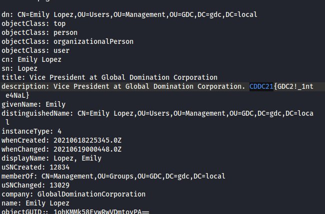

# Behind The Mask

This was a series of offensive Active Directory challenges hosted during CDDC 2021.

## Challenge #1: Light  
### Points: 200
### Challenge Text:  
It’s time to expose the GDC! We have successfully obtained the IP address of their AD server.   
First, try to list the different users that are configured on the server.  

### Solution  
The list of users from the DC can be obtained with the following command:
```ldapsearch -LLL -x -H ldap://18.136.74.102 -b ‘DC=gdc,DC=local' > enumAD.txt```
The flag is in the description for one of the users. I just opened the enumAD.txt file and
ctrl+F'ed for the flag format.  
  



