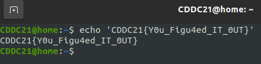

## [Up 1 directory](../CDDC_2021.md)
  
# Going Active
This is a set of active scanning challenges hosted during CDDC 2021.
I forgot most of the challenge texts exactly, but I documented information provided.
Apologies for the lack of screenshots, the CTF platform and all challenges were completely
taken offline very shortly after the CTF ended.

This is the category I had the most success with on day 1 of the CTF. I managed to solve  
all the challenges on the first day of the CTF. This category of challenges was very similar  
to techniques used for recon in vulnerable boxes in HTB, VulnHub and the PWK Labs.
  
## Mounting
### Points: 200
### Challenge text:
(forgot, but the IP 13.213.94.233 was provided.)
  
### Solution
Simple challenge, mount an NFS share and read the flag.
```
showmount -e 13.213.94.233
mkdir /mnt/nfs
mount -t nfs 13.213.94.233:/sharename /mnt/nfs
cd /mnt/nfs
cat flag.txt
CDDC21{I_L1ve_in_Ke4neL_L4ND}
```
  
## UnKnown
### Points: 300
### Challenge text:
(forgot, but same ip and port provided was 666.)
  
### Solution
When I nc'ed into the IP, it started printing a bunch of gibberish.  
  
```
[root@kali]-[192.168.132.128]-[CDDC] # nc 13.213.94.233 666
P�X�R��'*file.tarUT     ���`���`ux
�]����YHpw��{�^իW�������U����������������A�$Xp.�����_��''�?)
                                                            ��O_�r�qp,��l\,,�l3
                                                                               +
                                                                                ;@��_Y�������k=���K�h�Y�l��Pz�yB%У) %&���~����9�\�.��Ysa` �"���br�@g�4�������.������s )n<~^�)����k3/��=9"ài ����:jfƂ�X�Hkd��'���]    �OHL��Dn�~�63��;�����ae�SD���a'uf\v��O�y2�-�©�˻/��
                                                                                  ��

```  
I simply piped the gibberish into a file with the following command:
```
nc 13.213.94.233 666 > file.tar
```
and opened it as a zip. The flag file inside is shown here.

  
## VH2
### Points: 300
### Challenge text:
(forgot, but a URL was provided: dev02.globaldominationcorporation.xyz  
Something was said about not being able to access the server.)

  
### Solution
Challenge name is VH2, which stands for Virtual Host 2. I checked the certificate and found  
the alternate name gdc-internal02.globaldominationcorporation.xyz
Seems like there was a second VHOST, the steps taken to access the flag were:
  
```
1. ping the url to find the ip
2. add the subdomain gdc-internal02 to /etc/hosts with the ip found
3. access webpage
4. Flag found!
```
(sorry, flag was not saved :C )