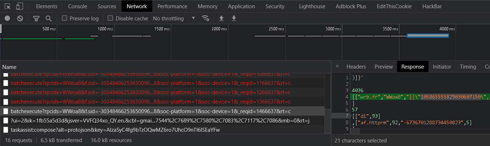
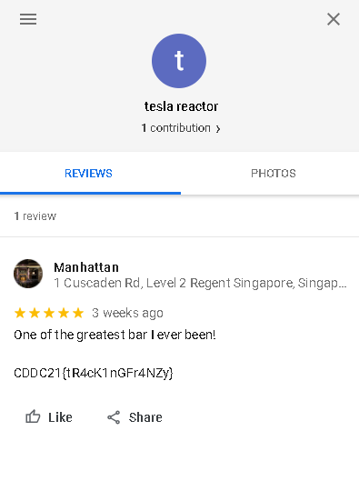

## [Up 1 directory](../)
  
# Lets Go Hunting
This is a set of OSINT challenges hosted during CDDC 2021.

## Broken System
### Points: 200
### Challenge text: 
The CryptIT Banking and Consulting company suspects that the GlobalDominationCorporation is attacking its email systems.  
They need your help to fix the misconfiguration.
  
### Solution
A quick google search found the website cryptit.biz. After some recon, we found the following text in a TXT record.
  
```
[root@kali]-[192.168.61.138]-[get ticket] # dig cryptit.biz TXT

; <<>> DiG 9.16.6-Debian <<>> cryptit.biz TXT
;; global options: +cmd
;; Got answer:
;; ->>HEADER<<- opcode: QUERY, status: NOERROR, id: 30457
;; flags: qr rd ra; QUERY: 1, ANSWER: 1, AUTHORITY: 0, ADDITIONAL: 1

;; OPT PSEUDOSECTION:
; EDNS: version: 0, flags:; MBZ: 0x0005, udp: 4096
;; QUESTION SECTION:
;cryptit.biz.                   IN      TXT

;; ANSWER SECTION:
cryptit.biz.            5       IN      TXT     "v=spf1 a mx ?all nice try, but this is not your flag"

;; Query time: 51 msec
;; SERVER: 192.168.61.2#53(192.168.61.2)
;; WHEN: Sat Jun 26 06:21:42 EDT 2021
;; MSG SIZE  rcvd: 105
```
  
One thing that we noticed was the presence of spf, due to the "v=spf1" in the TXT record. After much trial and error, the flag was found
in the TXT record of one of the common subdomains used for email security (due to the challenge text mentioning email systems being involved).
  
```
[root@kali]-[192.168.61.138]-[get ticket] # dig _dmarc.cryptit.biz TXT

; <<>> DiG 9.16.6-Debian <<>> _dmarc.cryptit.biz TXT
;; global options: +cmd
;; Got answer:
;; ->>HEADER<<- opcode: QUERY, status: NOERROR, id: 40311
;; flags: qr rd ra; QUERY: 1, ANSWER: 1, AUTHORITY: 0, ADDITIONAL: 1

;; OPT PSEUDOSECTION:
; EDNS: version: 0, flags:; MBZ: 0x0005, udp: 4096
;; QUESTION SECTION:
;_dmarc.cryptit.biz.            IN      TXT

;; ANSWER SECTION:
_dmarc.cryptit.biz.     5       IN      TXT     "v=DMARC; p=none; CDDC21{_10x_f0r_yOur_Serv!ce_}"

;; Query time: 115 msec
;; SERVER: 192.168.61.2#53(192.168.61.2)
;; WHEN: Sat Jun 26 06:24:08 EDT 2021
;; MSG SIZE  rcvd: 107
```  
Flag found! CDDC21{_10x_f0r_yOur_Serv!ce_}
  

## Track Him Down
### Points: 500
### Challenge text: 
TeslaReactor7 seems to be one of the GlobalDominationCorporation cybots. One of TheKeepers founded a strange video on his Youtube channel.  
Can you track him down?
  
### Solution
A youtube channel search found the channel named Tesla Reactor, with a single video on his channel. The video appears to be from the  
CTF organizers, confirming that this is indeed the correct channel.
  

  
We got his email address by going to the "About" tab of the channel.
  

  
One of my teammates was aware of an old trick, where you could get someone's google ID by adding them to your gmail contacts  
and trying to email them, where the id would be printed in the network tab of the browser dev console.  
  

  
Using the google id, a user's google maps reviews can be seen by going to the URL:  
google.com/maps/contrib/googleidhere  
e.g. google.com/maps/contrib/105865555829030607150  
  

  
Flag found! CDDC21{tR4cK1nGFr4NZy}
