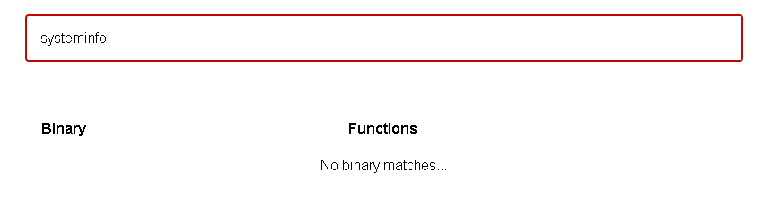

## [Up 1 directory](../CDDC_2021.md)
  
# Linux Rules The World!
This is a series of Linux challenges hosted during CDDC 2021.
The challenges must be solved in order.
  
## Challenge #1: Opening The Gate
### Points: 200
### Challenge text: 
One of TheKeepers has successfully obtained what seems to be one of the GDC private servers. He has sent me the image and another file, but unfortunately, I’m not great with Linux. I think you’re the one for this mission.
  
Target IP:
13.213.192.83
  
### Solution
The files provided were bot1.key and a text file named Notes.txt
  
Contents of Notes.txt  
```
Notice


1. As part of the ZIP file, you will find a text file that can be used to connect to the target machine. 

2. Each one of the flags is the password for the next user. Your main goal is to access the last user account.

3. The flags are located in the user home folders.

4. The passphrase for the SSH key is: q1w2e3r4
```
  
This is the starting challenge, which is to connect to the target via SSH.  
```
[root@kali]-[192.168.61.138]-[file] # ssh bot1@13.213.192.83 -i bot1.key
Enter passphrase for key 'bot1.key': 
Welcome to Ubuntu 20.04.2 LTS (GNU/Linux 5.8.0-1035-aws x86_64)
  
...
  
Last login: Thu Jun 24 02:30:47 2021 from 115.66.174.122
bot1@cybot02:~$ ls
flag.txt
bot1@cybot02:~$ cat flag.txt
CDDC21{S$H_keYs_are_Be!ter_than_PaSSw0rds}
bot1@cybot02:~$ 
```
  
## Challenge #2: Scrambled Eggs
### Points: 200
### Challenge text: 
Now you’re asking me what are all of these strings? This file looks like scrambled eggs to me. Those crazy Cybots always try to make it harder.
  
### Solution  
The first step of course, is to change to the next user, bot2, using the flag from bot1.
```
su bot2
```  
In the home directory, we see [a file](./Linux/flag.txt) containing a long list of invalid flag.  Based on past CTFs, this challenge involves finding the line in the correct flag format.  
This is a relatively simple challenge. Since the flag format is CDDC21{Flag}, we can write  
simple regex to find the flag.
  
I pasted the following regex into an online regex tester, along with the challenge file.
```
^CDDC21{.*}$
```  
This regex matches for a line that starts with CDDC21{ and ends with }.  
Flag found! CDDC21{Th1s_!s_IT}
  
## Challenge #2: Another Path
### Points: 200
### Challenge text: 
You must continue and pwn this machine. Please don’t bother me with all those bots. I know they’re connected somehow. If you feel stuck, try to take another path.
  
### Solution  
As before, the flag of bot2 was used to su as bot3. In bot3's home directory. There is a  
file named flag.txt owned by bot4. Given the challenge description, I can assume that this
is a linux privilege escalation challenge. The goal is to execute a command as bot4, which  
woudl allow us to read the flag.  
  
Since the home directory was not writable, I had to first locate a writable folder to run my  
tools from. I eventually found /run/screen was writable. I ran linpeas.sh, a common linux  
privilege escalation checker script. The script found that the "systeminfo" binary had the  
setuid bit set, and was owned by bot4. This means that if we can get it to execute commands  
for us, we can read the flag.
  
My first check was if [GTFObins](https://gtfobins.github.io/) had any existing SUID command execution methods for systeminfo.  
  

  
After a while, I noticed that the systeminfo binary used in the box was not the original  
binary that came with ubuntu. Based on the output, this binary was executing the "id"  
command. This can be exploited by adding our writable directory to the PATH environmental  
variable, and creating an "id" script in it. This way, when the "id" command is executed,  
it executes our script instead of the real one since it comes first in the PATH.  
This can be done with the following command:  
```
export PATH=/run/screen:$PATH  
echo /bin/bash -p > /run/screen/id  
chmod +x /run/screen/id
```  
Now, executing the systeminfo binary drops us into a shell as bot4!  
```
bot3@cybot02:~$ systeminfo
  
...
  
bot4@cybot02:~$ cat /home/bot3/flag.txt  
CDDC21{SU1d_!s_Qu1Te_DangeRouS}  
```
Flag found! CDDC21{SU1d_!s_Qu1Te_DangeRouS}


