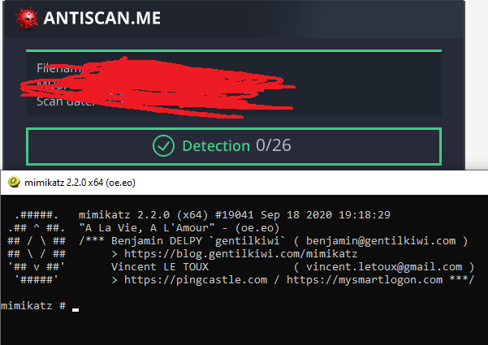

# Welcome to my terminal window!                                                               
###  This system is for the use of authorized users only.  Usage of   
###  this system may be monitored and recorded by system personnel.                                                                   
###           Other than that, feel free to look around!  
### root@codex # ls
### boxes code red_teaming CTF about
### root@codex # cd ./red_teaming
### root@codex # vi Mimikatz_vs_WinDef_in_2021
  
# Running Mimikatz without making Windows Defender angry (in 2021)

I've always wanted to get mimikatz to run on windows without getting flagged, but so far I have never been able to get a working Mimikatz binary past Windows 10 Defender.
However, since I recently made that fancy new FUD shellcode loader, I thought i'd give it another shot.

## Previous methods of running Mimikatz on windows
  
While I haven't been able to get a working Mimikatz.exe onto Windows 10 so far with Real Time Protection enabled, I have been able to perform mimikatz functionality using
a few methods, such as:
  
### Invoke-Mimikatz.ps1
  
[This](https://github.com/PowerShellMafia/PowerSploit/blob/master/Exfiltration/Invoke-Mimikatz.ps1) powershell version worked for a while, especially when Invoke-Obfuscation was newly released and working very well. However, over time, it started getting caught
at runtime and eventually caught on disk. Also, powershell logging would likely catch this, since unmanaged powershell is no longer as effective (at least in its default 
configuration from github).

### Reflectively loading mimikatz
  
I haven't actually tried this myself so far, due to the next method being my previously preferred method of mimikatz usage, but I have heard from friends over at [Infosec Prep](https://discord.gg/FBnEgHmce6) that you can
reflectively inject mimikatz and it will actually run, but then the powershell process will get flagged and killed shortly after. Still works though, but not so stealthy
if there's anyone watching alerts over at the blue team...

### In memory execution using an agent
  

  
This has so far been my most reliable method. Using an existing in memory agent such as Cobalt Strike's Beacon, or Metasploit's Meterpreter to execute mimikatz commands
has almost always worked for me so far. Sometimes it has been caught after execution (but it still did execute), similarly to reflectively loading it. On most occasions,
however, it works perfectly. This unfortunately requires an in memory agent to already be in place, so it's not as good for drive by attacks where I might just want to
plug in a USB, dump creds and run. However, this shows that undetected in memory execution of beacon is still possible.

## The dropper
  
Ok, so my goal is to make a FUD mimikatz.exe file, that is not detected both at scantime and at runtime. My first attempt was to make use of a shellcode runner I recently
made (not the python one, but with similar concepts and ported to C++/Go). I first needed a shellcode version of mimikatz. Now where could I find that...

### Donuts!
  
I found this great tool called [Donut](https://github.com/TheWover/donut) that takes .exes and other files and spits out a blob of shellcode. Great! More stolen code and
a few minutes later...Poof! mimikatz shellcode!  
  
So I threw it in my dropper and...No command line output. Lets see if it executed properly.  
One x64Dbg session later, I found the mimikatz shellcode in memory. So it did decrypt and write to memory correctly. Maybe the problem is that its not in the current
thread... I eventually found a set of arguments to pass to the memory functions in the dropper that made it select the current thread to execute in, and we have
mimikatz working!
  

  
Now, lets test it against AV!

Oh no, 4 detections. It seems like they are flagging it as Mimikatz, so they might have found the decryption key in the binary and used it to obtain the shellcode. Lets try
staging the decryption key, or having it generated at runtime somehow...
  

  
Yay! 0 detections. Now lets try it on Windows with Cloud protection enabled...

It loaded fine, but once the mimikatz UI popped up, it got flagged and the process was killed. Maybe the mimikatz shellcode blob in memory is detected after all... Lets try modifying the mimikatz binary before passing it into donut. For AV evasion purposes, I will not be showing the changes made the the binary beforehand, but they are not major, and do not affect any functionality of the mimikatz binary itself.

I then converted the modified binary to shellcode like before, and threw it in the working mimikatz dropper code I had before.
  

  
Yay! it works!

# END OF FILE
# -- INSERT --

