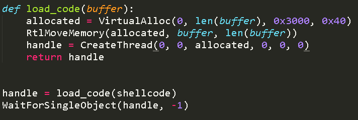

#My first shellcode runner
(Note: This was done like 2 year2 before this git pages site existed, just putting this here as a test page tbh LOL)

(Note 2: I will not show any future dropper code, in order to preserve their AV detection rates. (I know someone out there is gonna upload to VirusTotal). However, I will provide
some snapshots of this dropper(?), as it is already no longer FUD and has some major operational problems (as I will discover later) that make it less usable.)

One day, my cobalt strike beacons started getting caught by windows defender more than usual (guess default artifact kit pipe bypass won't work forever) so I decided
to make my own shellcode loader. Back then I only knew python, because I was a script kiddie (and still am) so I went and stole the first python shellcode runner I could
find on github. I cant find that original git repo anymore, but it essentially used ctypes in python to execute shellcode. 

Of course, since i'm pretty sure AV vendors spend all day browsing github for new shellcode runners to ruin, this code got caught too. So I had to steal some code from it
instead, and ask [this guy](https://medium.com/@jonoans) to help me with some of the remaining code because I could barely read ctypes or C at the time. Eventually, we
were able to get a basic python script that was able to execute shellcode. Here's some of my early shellcode exec code (please dont laugh at me i'll be sad)

