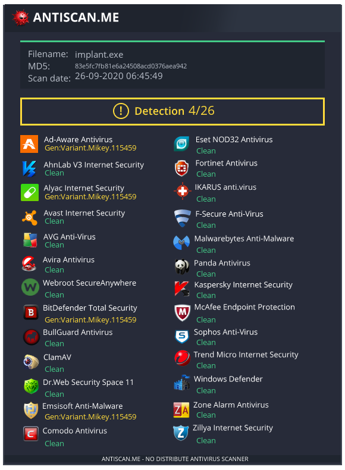
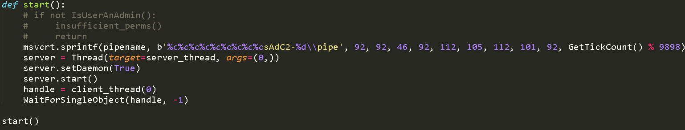
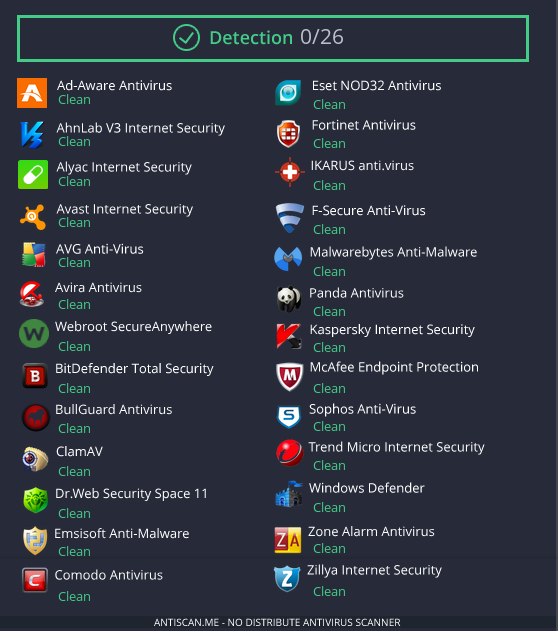

# Welcome to my terminal window!                                                               
###  This system is for the use of authorized users only.  Usage of   
###  this system may be monitored and recorded by system personnel.                                                                   
###           Other than that, feel free to look around!  
### root@codex # ls
### boxes code red_teaming CTF about
### root@codex # cd ./red_teaming
[Go up 1 directory](../red_teaming.md)
### root@codex # vi my_first_shellcode.md


# My first shellcode runner
(Note: This was done like 2 years before this git pages site existed, just putting this here as a test page tbh LOL)

(Note 2: I will not show any future dropper code, in order to preserve their AV detection rates. (I know someone out there is gonna upload to VirusTotal). However, I will provide
some snapshots of this dropper(?), as it is already no longer FUD and has some major operational problems (as I will discover later) that make it less usable.)

## Windows defender makes me sad
One day, my cobalt strike beacons started getting caught by windows defender more than usual (guess default artifact kit pipe bypass won't work forever), and none of my old 
tricks I learnt back in 2013-2014 e.g. Veil-Evasion, shellter etc worked anymore, so I decided to make my own shellcode loader. Back then I only knew python, because I was
a script kiddie (and still am) so I went and stole the first python shellcode runner I could find on github. I cant find that original git repo anymore, but it essentially 
used ctypes in python to execute shellcode. 

## Code Execution!
Of course, since i'm pretty sure AV vendors spend all day browsing github for new shellcode runners to ruin, this code got caught too. So I had to steal some code from it
instead, and ask [this guy](https://medium.com/@jonoans) to help me with some of the remaining code because I could barely read ctypes or C at the time (He did most of the thinking tbh). Eventually, we were able to get a basic python script that was able to execute shellcode. Here's some of my early shellcode exec code (please dont laugh at me i'll be sad)

  
(You can already see why I dont mind showing the code for this lol)

Ok, so this is the most basic shellcode exec I could think of. The classic VirtualAlloc, RtlMoveMemory, CreateThread combo. This actually got pretty good results against
AV, as you can see here.



Ok, 4 detections isnt horrible. It would be usable against a target as long as they arent using any of these 4 AVs. But I got concerned about the VirtualAlloc RtlMoveMemory
CreateThread combo getting flagged, so I stole an idea from Cobalt Strike's artifact kit bypasses, and tried implementing a named pipe shellcode exec technique.



Along the way I ran into an issue where the client thread would sometimes start before the server thread, leading to issues with the named pipe. (Do you know how annoying is it to debug code that WORKS HALF THE TIME?) This was eventually fixed by making the client run only after the server has started. Then I went and scanned it on antiscan and realised this technique somehow had a 6/26 detection ratio, somehow higher than before. sAd.

## Anti-VM done wrong
Eventually I suspected that those AVs were flagging on heuristics, not based on the signature (since its a custom dropper), since some of them identified it specifically
to be a Cobalt Strike beacon, and when I used a calc payload a lot of the detections dissappeared. So I stole even more code from github because im a scrub.  
Anyways here you go more stolen code:

```
def registry_check(self):  
        reg1 = os.system("REG QUERY HKEY_LOCAL_MACHINE\\SYSTEM\\ControlSet001\\Control\\Class\\{4D36E968-E325-11CE-BFC1-08002BE10318}\\0000\\DriverDesc 2> nul")
        reg2 = os.system("REG QUERY HKEY_LOCAL_MACHINE\\SYSTEM\\ControlSet001\\Control\\Class\\{4D36E968-E325-11CE-BFC1-08002BE10318}\\0000\\ProviderName 2> nul")       
        if reg1 != 1 and reg2 != 1:    
            print("VMware Registry Detected")
            sys.exit()  
              ...
def mac_check(self):
       mac_address = ':'.join(re.findall('..', '%012x' % uuid.getnode()))
       vmware_mac_list = ["00:05:69", "00:0c:29", "00:1c:14", "00:50:56"]
       if mac_address[:8] in vmware_mac_list:
            print("VMware MAC Address Detected")
            sys.exit()
```
Code from [https://github.com/PushpenderIndia/crypter/blob/master/BypassVM.py](https://github.com/PushpenderIndia/crypter/blob/master/BypassVM.py)

Aaaand it increased my detections. I guess AVs really dont like me checking if i'm in a VM. I wonder why that could be...

## Encryption is good

Oh wait they might be flagging me on the huge default Cobalt Strike generated beacon shellcode blob in the middle of my binary. I wonder what will happen if I encrypt that
blob and decrypt it at runtime...

More stolen code later, (from the same git repo as before) and I got it to AES key the shellcode blob with a random number from 1 to 1000, and brute force its own key
at runtime. This way, without actually waiting for that long it shouldnt be possible to decrypt the blob using the AV built in sandbox tests, and it should evade any
static signatures for that pesky beacon shellcode blob.

Lets test now...



Yay! 0 detections. Guess i'm done!
These ideas would eventually be used in of most of my AV evaded droppers in the future...

## Python droppers = bad
I quickly realised there was a huge problem with python. The python code is stored in the binary, with a small python interpreter. This causes 2 problems. Firstly, all
my binaries were like 20MB, even with the tiniest shellcode payloads e.g. calc. Even after UPX ultra brute, this would still be around 10MB I tried to strip the symbols, but it didn't work for me. The friend was able to do it though, for reasons I still do not know. That reduced it to around 7MB, which is still way too big for a calc payload. 
Secondly, it is probably super easy to reverse engineer and signature, since its still python code. It also happens to write some files to a temp directory.  
tl;dr Python droppers have horrible OPSEC

This led me to eventually start converting my offensive tools to C++ and Golang, as both these languages can be compiled into binaries (no interpreter gimmicks here!) which
are much smaller, 1-2MB in size.
  
  
  
  
# End Of File
## -- INSERT --
