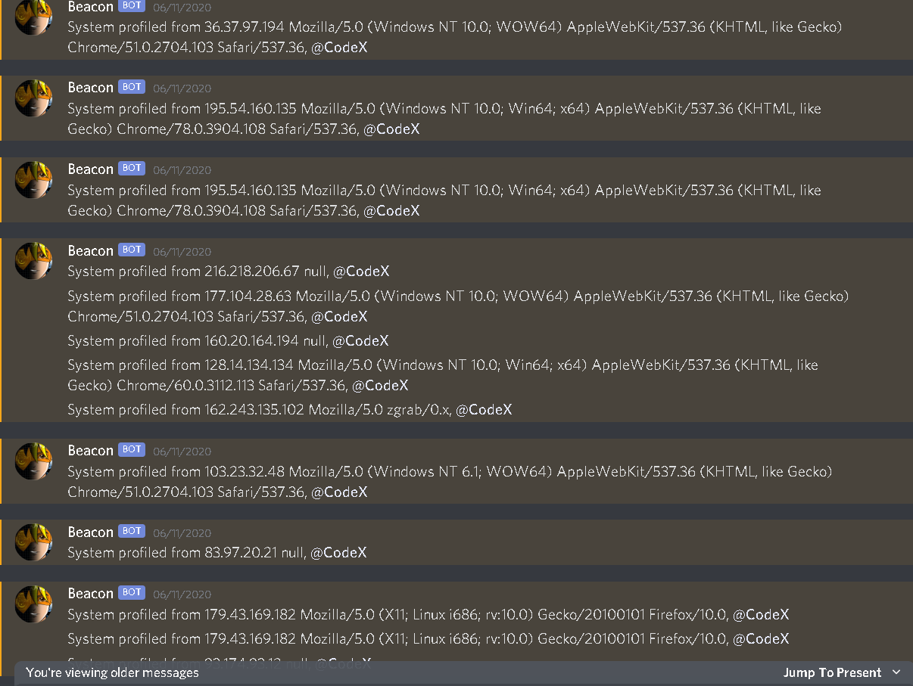
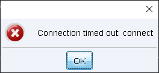
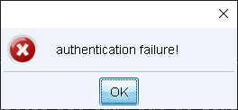

# Welcome to my terminal window!                                                               
###  This system is for the use of authorized users only.  Usage of   
###  this system may be monitored and recorded by system personnel.                                                                   
###           Other than that, feel free to look around!  
### root@codex # ls
### boxes code red_teaming CTF about
### root@codex # cd ./red_teaming
[Go up 1 directory](../red_teaming.md)
### root@codex # vi protecting_my_teamservers.md
  
# Protecting my C2 infrastructure from annoying scanner monkeys (and some pesky AV vendors)
  
 ## Why do I need to protect my C2 infra?
 Because scanner monkeys (and sometimes pesky security vendors) like to scan the internet for certain C2 signatures e.g. Cobalt Strike teamservers and profile them. One such 
 example is [these people](https://blog.fox-it.com/2019/02/26/identifying-cobalt-strike-team-servers-in-the-wild/) who went and started fingerprinting Cobalt Strike teamservers
 using an anomalous space in NanoHTTPD. Or the time I woke up to this monstrosity:  
   
 
    
and this:
```
User : me *
Computer Name : W7SB64-01
External IP : 184.185.5.53
Internal IP : 172.16.28.12
Arch : x64, @CodeX
```
Which according to [this blackhat article](https://www.blackhat.com/docs/us-17/thursday/us-17-Kotler-The-Adventures-Of-Av-And-The-Leaky-Sandbox-wp.pdf) is Comodo messing
with my beacons >:C
  
So the first thing I did was disable payload staging. According to [the official Cobalt Strike documentation](https://www.cobaltstrike.com/help-malleable-c2), this can be done by setting host_stage to false.
I know, not being able to stage an entire beacon in a 12kb binary is a little bit sad, but at least AV vendors arent able to instantly get a copy of my artifacts, and
building detections for my artifact kit profiles. But then, theres also another way of detecting team servers: by logging in normally  
  
This is the response when you try to login to a non Cobalt Strike server with the Cobalt Strike client:  
 
   
But this is what you get if you try logging into a real teamserver with an incorrect password:  
 
   
 I'm not entirely sure how efficient it would be to fingerprint teamservers this way, but I dont want ANYBODY trying to fingerprint my box as a Cobalt Strike teamserver
 (maybe because I borrowed this box from a friend, and he really doesnt want his IP to get blacklisted as a teamserver). So, what can I do to prevent login attempts?
 
 I could just use a nonstandard port that isnt 50050 for my login, but there's still the chance that someone stumbles across it while scanning a larger port range. So,
 I decided to use a very simple trick to prevent people from being able to try to login: [SSH tunneling](https://www.ssh.com/academy/ssh/tunneling/example).
 So by setting up iptables rules to block all traffic to my login port from 0.0.0.0, and a rule that allows traffic to that port from 127.0.0.1. This way, outsiders who try
 to connect to it will just get connection refused.  
  
 
 All I need to do to login, is create an SSH tunnel from the server to my box with the following command:  
 ```
 ssh user@my.ip.here -L 50050:127.0.0.1:50050
 ```
   
 And now I can login as normal with the Cobalt Strike client!
  
